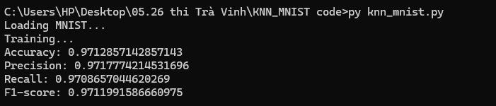
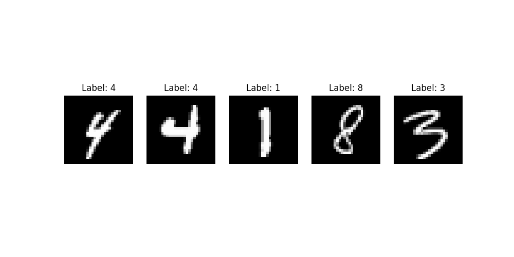
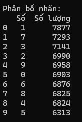
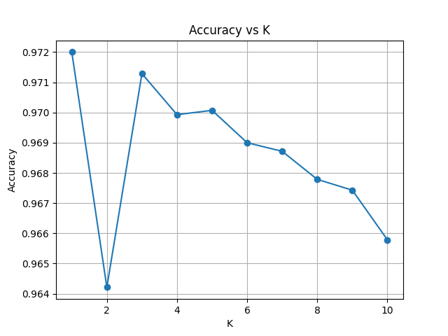
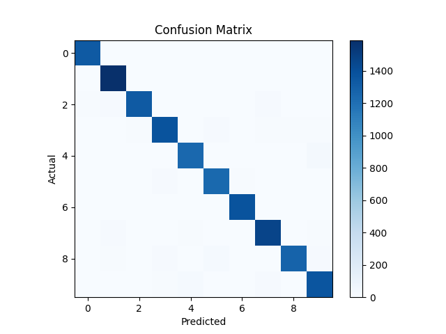
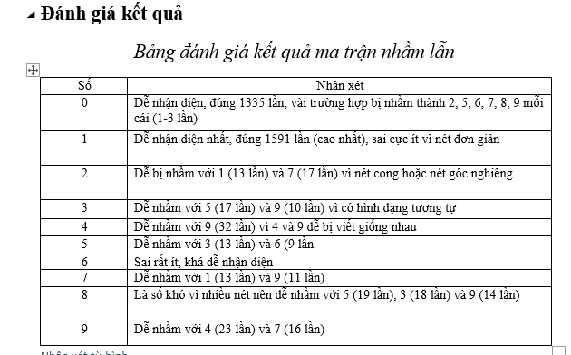

# Nhận dạng chữ số viết tay bằng KNN

## 📌 Giới thiệu
Đề tài sử dụng thuật toán **K-Nearest Neighbors (KNN)** để phân loại chữ số viết tay từ bộ dữ liệu **MNIST**.

## ⚙️ Công cụ sử dụng 

**Ngôn ngữ lập trình**
- Python 

## 📦 Thư viện sử dụng
- `numpy`: xử lý dữ liệu số
- `scikit-learn`: xây dựng mô hình KNN
- `matplotlib`: vẽ biểu đồ
- `pandas`: xử lý, phân tích và quản lý dữ liệu dạng bảng
- `openpyxl`: giúp xuất dữ liệu ra file Excel

## 📂 Dataset: MNIST

- Số lượng mẫu: 70,000 ảnh
- Kích thước ảnh: 28x28 pixels
- Số lớp: 10 (từ 0 đến 9)
- Mỗi ảnh được biểu diễn thành vector 784 chiều

## 📌 Cách chạy trên CMD

* **Bước 1**: cài đặt thư viện 
Gõ lệnh `py -m pip install -r requirements.txt` 

📦 requirements.txt 
- `numpy` 
- `scikit-learn` 
- `matplotlib` 
- `pandas` 
- `openpyxl` 

* **Bước 2:** Chạy code 

_Trường hợp 1_: Chạy mô hình cơ bản 
`py knn_mnist.py` 

_Trường hợp 2_: Tối ưu và phân tích tham số K, hiển thị ma trận nhầm lẫn 
`py train.py` 

### 📷 Hiển thị vài mẫu ảnh ngẫu nhiên
Dữ liệu MNIST gồm các ảnh chữ số viết tay kích thước 28x28 pixel.  
Để trực quan hóa dữ liệu, ta hiển thị ngẫu nhiên 5 ảnh từ dataset. 

## 📊 Kiểm tra phân bố nhãn

## 📊 Kết quả
- `Accuracy`: ~97%
- `Precision`: ~97%
- `Recall`: ~97%
- `F1-score`: ~97%
**=> Model đạt accuracy ~97.20%, cùng với precision, recall và F1-score đều xấp xỉ 97%.
Điều này cho thấy mô hình hoạt động ổn định và không bị lệch về một lớp cụ thể. Với thuật toán KNN, mức accuracy trên ~97% được xem là kết quả tốt trên tập MNIST, đặc biệt khi chưa áp dụng các kỹ thuật tối ưu nâng cao.** 

## 📈 Tối ưu tham số $K$
Biểu đồ dưới đây thể hiện độ chính xác theo các giá trị K khác nhau:

_Kết quả cho thấy tuy K = 1 cho độ chính xác cao nhất, nhưng mô hình có thể nhạy với nhiễu (noise) và dễ bị overfitting. Trong thực tế, các giá trị K lớn hơn (như 3 hoặc 5) thường được cân nhắc để đảm bảo tính ổn định_.

## 📈 Phân tích tham số $K$ (Hyperparameter Tuning)

Trong đồ án này, mình đã thực hiện khảo sát giá trị $K$ từ 1 đến 10 để tìm ra điểm tối ưu cho mô hình.

- **Tại sao chọn phạm vi 1-10?**
    - **Đặc thù dữ liệu:** Với bộ dữ liệu MNIST, các đặc trưng đã được chuẩn hóa tốt, các láng giềng gần nhất thường mang đặc điểm rất giống nhau. Qua thực nghiệm, giá trị $K$ nhỏ (thường là số lẻ < 10) đem lại độ chính xác cao nhất (trên 96%).
    - **Hiệu năng:** Vì KNN là thuật toán "Lazy Learning", việc tăng $K$ quá lớn sẽ làm tăng khối lượng tính toán và thời gian dự đoán mà không cải thiện đáng kể độ chính xác.
    - **Tránh Underfitting:** Khi $K$ quá lớn, ranh giới phân loại giữa các chữ số bị làm mờ, dẫn đến mô hình bị đơn giản hóa quá mức.

*Kết quả khảo sát chi tiết có thể xem tại tệp `accuracy_vs_k.png`.*

## 📷 Ma trận nhầm lẫn
Ma trận nhầm lẫn giúp đánh giá chi tiết khả năng phân loại của mô hình:

## Bảng xét và đánh giá
 

## 📊 Analysis 
1. Nhận xét về K: 
- Khi K nhỏ (K=1), model dễ overfitting: 
      * K=1 → 97.2% (cao nhất)
      * K=3 → 97.13% (rất sát)
- Khi K lớn, model ổn định hơn nhưng có thể underfit
- Giá trị K = X cho kết quả tốt nhất vì cân bằng bias–variance
- **Giá trị K tốt nhất là K = 1, cho thấy mô hình đạt độ chính xác cao nhất khi chỉ xét láng giềng gần nhất. Điều này giúp mô hình bắt được các mẫu rất chi tiết trong dữ liệu, nhưng cũng có nguy cơ bị overfitting (nhạy với nhiễu).** 

**2. Phân tích confusion matrix:**
Một số chữ số dễ bị nhầm lẫn do hình dạng tương tự
- Ví dụ:
      4 ↔ 9
      7 ↔ 1
      8 ↔ 3
=> Điều này xảy ra vì dữ liệu viết tay không đồng nhất

**3. Nhận xét tổng thể:** 
- Model đạt accuracy ~97% → mức khá tốt cho KNN
- Tuy nhiên vẫn tồn tại lỗi với các chữ số phức tạp

📌 **Đánh giá chi tiết từng file:**

🔹 `knn_mnist.py`:
Sử dụng giá trị K cố định (K = 3) để huấn luyện mô hình
Tính đầy đủ các chỉ số đánh giá:
`Accuracy`
`Precision`
`Recall`
`F1-score`
Hiển thị ma trận nhầm lẫn dưới dạng hình ảnh đơn giản

**Ưu điểm:**  
- Code ngắn gọn, dễ hiểu
- Phù hợp để minh họa thuật toán KNN cơ bản

**Nhược điểm**: 
- Không kiểm tra nhiều giá trị $K$ nên chưa tối ưu mô hình
- Confusion Matrix chưa hiển thị rõ nhãn

🔹 `train.py`: 
- Dùng scikit-learn chuẩn
- Train/test split (80/20)

**Ưu điểm:** 
- Có thử nhiều K
- Có quy trình tối ưu rõ ràng
- Trực quan hóa dữ liệu tốt (ảnh + biểu đồ)
- Confusion Matrix hiển thị chuyên nghiệp
- Hiển thị đủ các chỉ số đánh giá mô hình
- Có báo cáo chi tiết bằng Excel

**Nhược điểm:** 
- Thời gian chạy lâu hơn do thử nhiều giá trị _K_

🎯 **Kết luận** 
- File: `knn_mnist.py` phù hợp để minh họa đơn giản thuật toán 
- File: `train.py` phù hợp để làm đồ án và báo cáo chuyên sâu

**## ⚠️ Hạn chế** 
- Rất chậm khi dữ liệu lớn
- Chưa chuẩn hóa dữ liệu
- Chưa thử nhiều distance metric
- Không có giai đoạn học thực sự vì KNN chỉ “ghi nhớ dữ liệu” nên không tối ưu hóa gì

**Hướng cải thiện:**
- Chuẩn hóa dữ liệu (scaling)
- Dùng PCA giảm chiều
- Thử SVM / CNN
